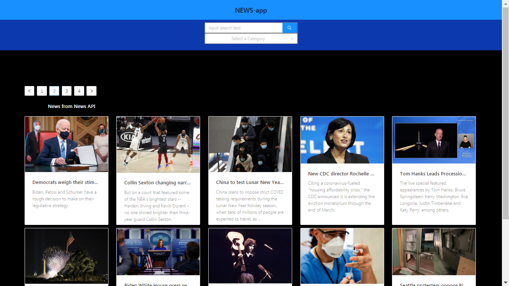

# NEWS-API
 
<h4> Note: regular tier for news-api doens't allow to access data other than Localhost:3000, SO it can be Deployed in Heroku or Netlify
 

 What I used React, News-api
 

 First, clone the project using command <i>git clone</i> along with thae repo url.
 

 then download dependencies with command <i>npm i</i>, after that start the server by typing <i>npm start<i/> to start the server on Localhost:3000.

